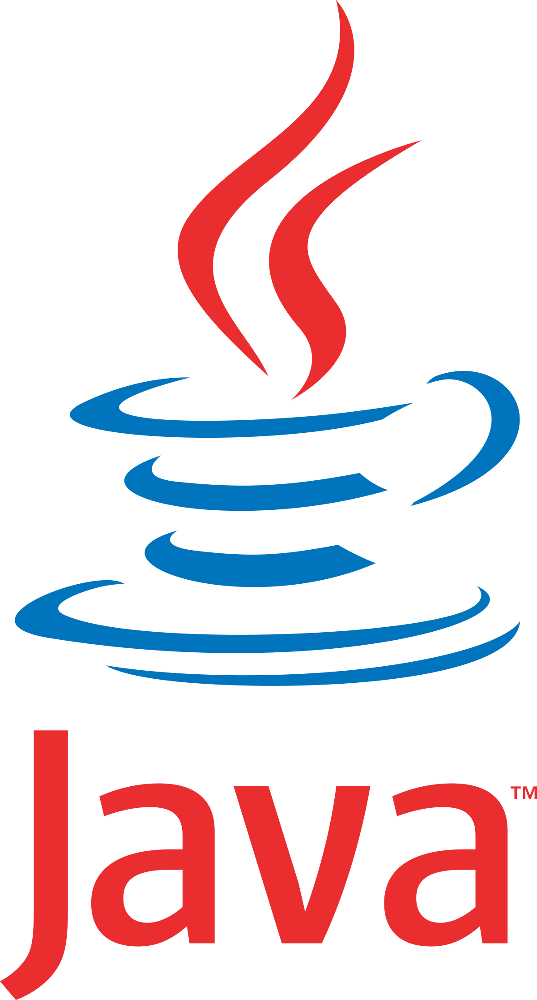

# Qui suis-je ?
<table>
  <tr>
    <td>Blanchard Rémi</td>
    <td>21 ans</td>
  </tr>
  <tr>
    <td>Etudiant</td>
    <td>Troisième année BUT Informatique</td>
  </tr>
</table>

## Mon parcours
- Lycée général Cabanis spécialité Mathématique, NSI et SI.
- But Informatique Limoges

## Mes objectifs
Mes objectifs professionnels sont de pouvoir acquérir au cours de ma carrière des compétences et de l'expérience afin de pouvoir évoluer et diriger une équipe.
Ce qui est nécessaire dans le monde du travail est la bonne cohésion entre les différents partenaires. J'aspire donc à développer mes compétences de communication pour mieux comprendre les besoins de mes collègues.  

En ce qui concerne mes objectifs personnels je veux trouver un métier qui me passionne et où je m'épanouis. De plus je compte maitriser plusieurs langages et en apprendre de nouveaux. Ensuite j'espère pouvoir travailler en France mais aussi à  l'étranger. Ces différentes expériences professionnelles peuvent m'apporter un enrichissement personnel.
## Compétences et techniques transversales
### Hard Skills
- 
- 
- 
- 
- 
- 
- 
- 
- 

### Soft Skills
- Adaptation
- Reflexion
- Patience
- Curiosité
- Jugement et prise de décision
- Esprit d'équipe
  
## Présentation des projets universitaires
### Escape Game en 3D sur Unity en C#
### Le verger jeu plateau avec du JAVA/JAVA FX
### Organisation d'un forum / JPO
### Mise en place d'un réseau fictif pour une entreprise
### Créer une base de donnée à partir d'un fichier csv
### Mise en place d'une application pour gérer un calendrier prévisionnel

  ## Expériences
  - Stage de 10 semaines chez Thales
  - Création d'une solution en Python pour aider à détecter les pannes sur des équipements

## Me contacter
Mail : remi.blanchard1@etu.unilim.fr \
Numéro : 06 65 41 57 64
